REDIS VERİ TÜRLERİ 

String : En temel ve basit veri türüdür. Metinsel değerler saklamak için kullanılır. Binary olarak resim dosya vs saklanabilir.

List: Koleksiyonel olarak veriler tutulmasını sağlar.

Set: Birbirinden farklı unique değerler tutulmasını sağlar (sırasız).
Sorted Set: Birbirinden farklı unique değerler tutulmasını sağlar (sıralı).
Hash: Field-Value formatında veri tutulmasını sağlayan veri türüdür.
Streams: Log gibi haraket eden veri türüdür.
Geospatial Indexes: Coğrafi koordinatların saklanmasını sağlayan veri türüdür.

**Redis String** :
SET :  veri ekleme  # SET KEY VALUE

GET: veri okuma # GET KEY

GETRANGE: karakter aralığı okuma #GETRANGE KEY START END

INCR & INCRBY: int değerlerde incr komutu 1’er olaraka artırırken incrby  komutu verdiğimiz değere göre artış sağlar  #INCR KEY   #INCRBY KEY INCREMENT

DECR & DECRBY: incr ve incrby komutlarını tersidir.	

Append: üzerine ekleme komutudur #APPEND KEY VALUE

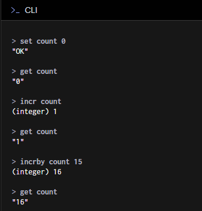

#append count 10 dediğimizde değeri 16 olan bir verinin değeri 1610 olacaktır.

**Redis List:**
LPUSH: başa veri ekleme #LPUSH KEY VALUE

LRANGE: verileri listeleme #LRANGE KEY START END

RPUSH: sona veri ekleme #RPUSH KEY VALUE

LPOP: ilk datayı çıkarma #LPOP KEY

RPOP: son datayı çıkarma #RPOP KEY

LINDEX: indexe göre datayı getirme #LINDEX KEY INDEX

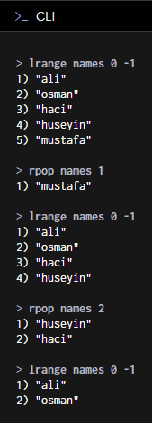

**Redis Set:**

SMEMBERS: listeleme #SMEMBERS KEY

SADD: ekleme #SADD KEY MEMBER

SREM: silme #SREM KEY MEMBER

SISMEMBER: arama #SISMEMBER KEY MEMBER

SINTER: iki set arasındaki kesişimi getirir. #SINTER KEY KEY…

SCARD: eleman sayısını getirir. #SCARD KEY

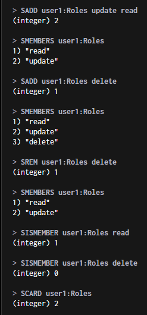

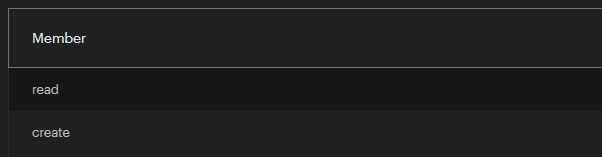

**Redis Sorted Set:**

ZADD: ekleme #ZADD KEY SCORE MEMBER

ZRANGE: listeleme #ZRANGE KEY START END #ZRANGE KEY START END WITHSCORES

ZREM: silme #ZREM KEY MEMBER

ZREVRANK: sıralama öğrenme #ZREVRANK KEY MEMBER

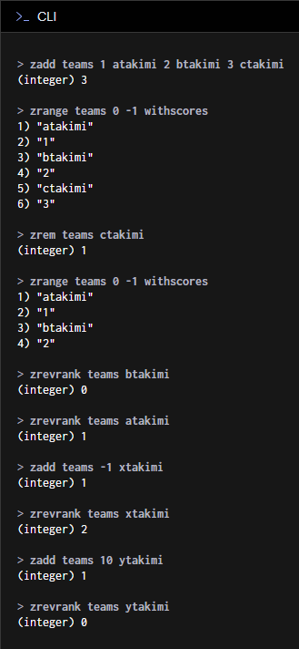

Redis Hash:
HSET: ekleme #HSET KEY FIELD VALUE

HGET: getirme #HGET KEY FIELD

HDEL: silme #HDEL KEY FIELD

HGETALL: tümünü getirme #HGETALL KEY

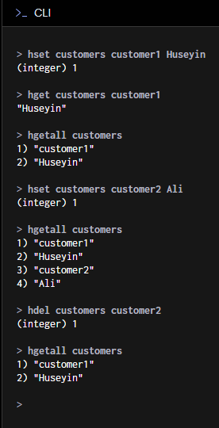

.NET CORE CACHING

1-IN MEMORY CACHE

-AddMemoryCache servisi uygulaya ekle

-IMemoryCache referansını inject et

-Set metoduyla cacheleme yapabilir. Get ile cachlenmiş verileri elde edebilirsiniz.

-Remove metodu ile cachlenmiş veriyi sil.

-TryGetValue metodu ile kontroollü şekilde cacheden veriyi okuyabiliriz.

Program.cs
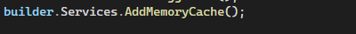

ValuesController.cs

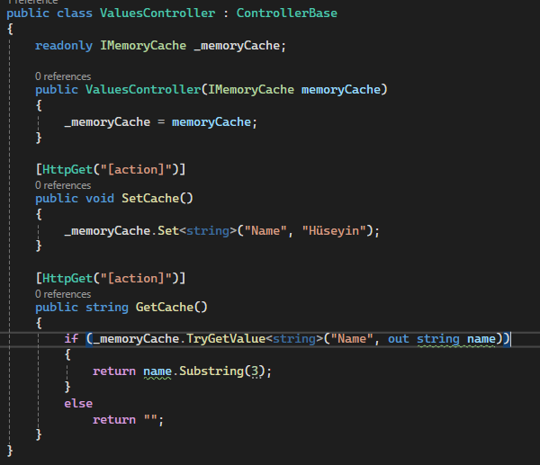

Absolute Time: Cachedeki datanın ne kadar süre tutacalağının belirlenmesidir.

Sliding Time: Belirtilen süre zarfında cachedeki dataya erişim var ise cache ömrü bir o kadar daha uzatılacaktır.

2-DISTRIBUTED CACHE

-Microsoft.Extensions.Caching.StackExchangeRedis kütüphanesini yükle

-AddStackExchangeRedisCache servisini uygulamaya ekle

-IDistributedCache referansını inject et

-SetString metodu ile metinsel Set metodu ile ise binary olarak verileri redis e cachleyebilirsiniz. Aynı şekilde GetString ve Get fonksiyonlarıyla da cachlenmiş verileri elde edebilirsiniz.

-Remove fonksiyonu ile cachlenmiş verileri silebilirsiniz.

**Redis Sub/Pub Özelliği**

-StackExchange.Redis Kütüphanesini yükleyiniz.

-ConnectionMultiplexer sınıfından bağlantıyı oluşturunuz.

-ISubscriber sınıfından subscriber oluşturun.

-Bu aşamada Publisher ve Consumer olarak ikiye ayrılacaktır.

-ISubscriber instancei üzerinden PublishAsync ile kanala mesaj yayınlayabilir.

-aynı instance üzerinden SubscribeAsync ile kanaldan gelen mesajları okuyabilirsiniz.

Publisher:

Subscribtion:

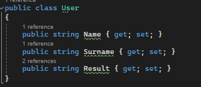

Pattern Belirleme:

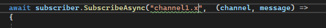

Yukarıdaki gibi bir patternde aşağıdaki gibi mesaj gönderilince yakalanmayacaktır.

Ancak aşağıdaki gibi yapıldığında veri elde edilebilir.

tüm kanallardan gelen istekleri karşılamak için aşağıdaki gibi bir yöntem izlenmelidir.
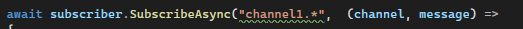

**REDIS REPLICATION**

Master-Slave ilişkisi ile iki redis sunucusunda masterdaki verilerin slave e yedeklenmesidir.

**REDIS SENTINEL**

Redis Sentinel, master slave sistemi üzerinde çalışan bir sistemdir. Sentinel veritabanlarının sağlığını inceler ve herhangi bir problem veya kesinti durumnda en sağlıklı olan sunucuya failover işlemini (yük devretme) gerçekleştirir.  Böyle işlemler farklı bir sunucu üzerinden kaldığı yerden devam eder.
